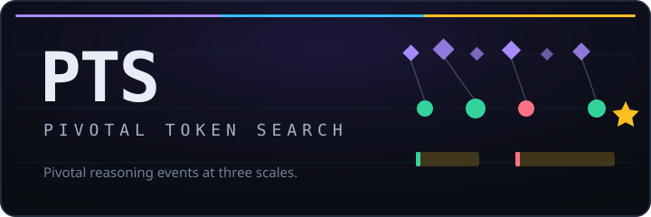

<div align="center">



**A causal-event search framework for model reasoning.**

*Find the pivotal reasoning events that shift a model's chance of solving a task — at three scales at once.*

<a href="https://github.com/codelion/pts/stargazers"></a>
<a href="https://github.com/codelion/pts/blob/main/LICENSE"></a>

<a href="https://huggingface.co/spaces/codelion/pts-visualizer"></a>

[Quick start](#quick-start) • [The three scales](#the-three-scales) • [Results](#results) • [Related work](#related-work) • [Visualizer](https://huggingface.co/spaces/codelion/pts-visualizer)

</div>

---

## What PTS is

A language model's path to an answer has **turning points** — places where one
choice flips the outcome. Some are hidden in the residual stream as concepts the
model has not yet said out loud; some are emitted as a single token; some expand
into a whole reasoning sentence.

PTS is the claim, and the tooling, that these are **the same kind of object at
different scales**. It searches for them, scores them by a single principle,
labels them from one taxonomy, and links them into one causal graph:

```
latent meta-token / workspace event        ← Latent PTS
        │
emitted pivotal token                       ← Token PTS
        │
sentence-level thought anchor               ← Sentence PTS
        │
success / failure probability shift
```

Every event is scored the same way:

```
event_importance  =  outcome_with_event  −  outcome_without_or_altered_event
```

## The three scales

Each scale connects to an existing line of work — PTS is the frame that holds all
three together, not a replacement for any of them.

| Scale | What it finds | How it's scored | Connects to |
|---|---|---|---|
| **Latent PTS** | Verbalizable concepts active in the mid-layer workspace, not yet emitted | J-lens readout score | Anthropic's workspace / J-lens [[1]](#references) |
| **Token PTS** | Emitted tokens that flip success probability | `P(success \| prefix+token) − P(success \| prefix)` | Phi-4 Pivotal Token Search [[2]](#references) |
| **Sentence PTS** | Reasoning sentences that flip success probability | `P(success \| prefix+sentence) − P(success \| +alternative)` | Thought Anchors [[3]](#references) |

The empirical claim PTS exists to test:

> Many emitted pivotal tokens and thought-anchor sentences are preceded by latent
> verbalizable meta-tokens in the model's workspace.

## Install

```bash
git clone https://github.com/codelion/pts.git && cd pts
pip install -e .
```

`import pts` pulls in no torch or transformers — the event schema, storage,
classification, and linking layers are pure Python; anything that touches a model
loads lazily.

## Quick start

```bash
# Token PTS — emitted pivotal tokens (the original idea)
pts run --granularity token --model Qwen/Qwen3-0.6B --output-path events.jsonl

# Sentence PTS — thought anchors
pts run --granularity sentence --model Qwen/Qwen3-0.6B --output-path events.jsonl

# Latent PTS — enrich an existing dataset with workspace meta-tokens.
# Reuses curated PTS data instead of re-searching; older files work directly.
pts fit-jlens --model Qwen/Qwen3-0.6B --output-path ./jlens         # calibrate once
pts enrich --input-path events.jsonl --output-path events_latent.jsonl \
           --model Qwen/Qwen3-0.6B --jlens-path ./jlens \
           --readout-method jlens --with-latent --shuffle-control

# All three scales, linked into one causal graph
pts run --granularity all --model Qwen/Qwen3-0.6B \
        --readout-method jlens --jlens-path ./jlens --output-path events.jsonl
```

No J-lens yet? `--readout-method logit_lens` needs no calibration and works
immediately — it's the same construction with `J = I` (weaker evidence; see
[docs/latent_pts.md](docs/latent_pts.md)).

Explore any result in the [**hosted visualizer**](https://huggingface.co/spaces/codelion/pts-visualizer),
or run it locally with `cd visualizer && python app.py`.

## Results

Enriching two reasoning models and testing whether the J-lens (what an activation
pushes the model to say *later*) beats a logit-lens control (what it would say
*now*) — the discriminating test for a real workspace:

| | Qwen3-0.6B | DeepSeek-R1-1.5B |
|---|---|---|
| Meta-token category-matches the event it precedes, vs chance | 2.6× | **3.6×** |
| J-lens lift | 2.76× | **3.64×** |
| logit-lens lift (control) | 2.41× | 3.29× |
| **J-lens beats logit-lens?** | trends ahead, overlapping (n≈100) | **yes** (n=239) |

The separation is clearer on the larger model — the direction the workspace
hypothesis predicts. **These are observational, not causal**: no intervention was
run. See the dataset cards for the honest, per-model write-ups.
[[Qwen]](https://huggingface.co/datasets/codelion/Qwen3-0.6B-pts)
[[DeepSeek]](https://huggingface.co/datasets/codelion/DeepSeek-R1-Distill-Qwen-1.5B-pts)

## Commands

| Command | Does |
|---|---|
| `pts run --granularity token\|sentence\|latent\|all` | Search for pivotal events |
| `pts enrich --with-latent` | Add latent meta-token events to an existing dataset |
| `pts fit-jlens` | Calibrate a Jacobian lens for a model |
| `pts link` | Link latent → token → sentence into causal chains |
| `pts migrate` | Read older pivotal-token / thought-anchor files into the event schema |
| `pts export --format …` | `causal_events`, `metatokens`, `pivotal_tokens`, `thought_anchors`, `dpo`, `steering` |
| `pts push` | Upload to Hugging Face |

DPO pairs and steering vectors (the latter feed [OptiLLM](https://github.com/codelion/optillm)'s
autothink) are `export` formats — see [docs/compatibility.md](docs/compatibility.md).

## Related work

PTS is a synthesis: the contribution is the **unified framework**, and
each scale is anchored to prior work rather than invented in a vacuum.

- **Token PTS** is the Pivotal Token Search idea from the **Phi-4 technical
  report** [[2]](#references), generalized from a standalone token method into one
  scale of a larger object.
- **Sentence PTS** corresponds to **Thought Anchors** [[3]](#references) —
  sentence-level reasoning steps that matter — recast as the sentence scale of the
  same event.
- **Latent PTS** reads the model's hidden workspace using a Jacobian lens,
  inspired by Anthropic's **workspace / J-space** work [[1]](#references). It is
  an **independent reimplementation from the paper's published equations** (no
  reference code was released), verified for internal correctness against a
  brute-force autograd Jacobian but **not** validated against the authors'
  results. "Meta-token" is our term, not theirs.

Read the [three-scales table](#the-three-scales) left-to-right and it is the
thesis: what Phi-4 found in emitted tokens and Thought Anchors found in reasoning
sentences is the same phenomenon at different scales, and the workspace literature
describes where it lives before it is emitted at all. Inspired by, related to, and
compatible with — **not** the same as.

## Caveats

Latent PTS is the newest, least-settled part. Do not oversell it.

- **A latent event's `score` is a readout probability, not a Δ-probability.**
  `prob_delta` and `is_positive` are `null` on latent events by construction —
  never compare or threshold them against emitted scores.
- **Latent events are observational.** Showing a meta-token *causes* an emitted
  event needs an intervention (steer/ablate, re-measure). Not implemented.
- **Links are scored heuristics.** Always run `--shuffle-control`; if the observed
  link scores don't beat the shuffled baseline, the structure is not above chance.
- **Records are model-specific.** A token pivotal for one model says nothing about
  another.

## Documentation

- [docs/latent_pts.md](docs/latent_pts.md) — the J-lens, the math, and what would make it convincing
- [docs/dataset_schema.md](docs/dataset_schema.md) — the unified event schema
- [docs/compatibility.md](docs/compatibility.md) — reading older datasets, and the bugs that changed results

## References

1. Anthropic, *Verbalizable Representations Form a Global Workspace in Language
   Models* (2026). [transformer-circuits.pub/2026/workspace](https://transformer-circuits.pub/2026/workspace/index.html)
2. Microsoft, *Phi-4 Technical Report* (2024), which introduces Pivotal Token
   Search. [arXiv:2412.08905](https://arxiv.org/abs/2412.08905)
3. P. C. Bogdan, U. Macar, N. Nanda, A. Conmy, *Thought Anchors: Which LLM
   Reasoning Steps Matter?* (2025). [arXiv:2506.19143](https://arxiv.org/abs/2506.19143)
   · [code](https://github.com/interp-reasoning/thought-anchors)

## Citation

```bibtex
@software{pts,
  title = {PTS: Pivotal Token Search},
  author = {Asankhaya Sharma},
  year = {2025},
  publisher = {GitHub},
  url = {https://github.com/codelion/pts}
}
```

## License

[Apache 2.0](LICENSE)
