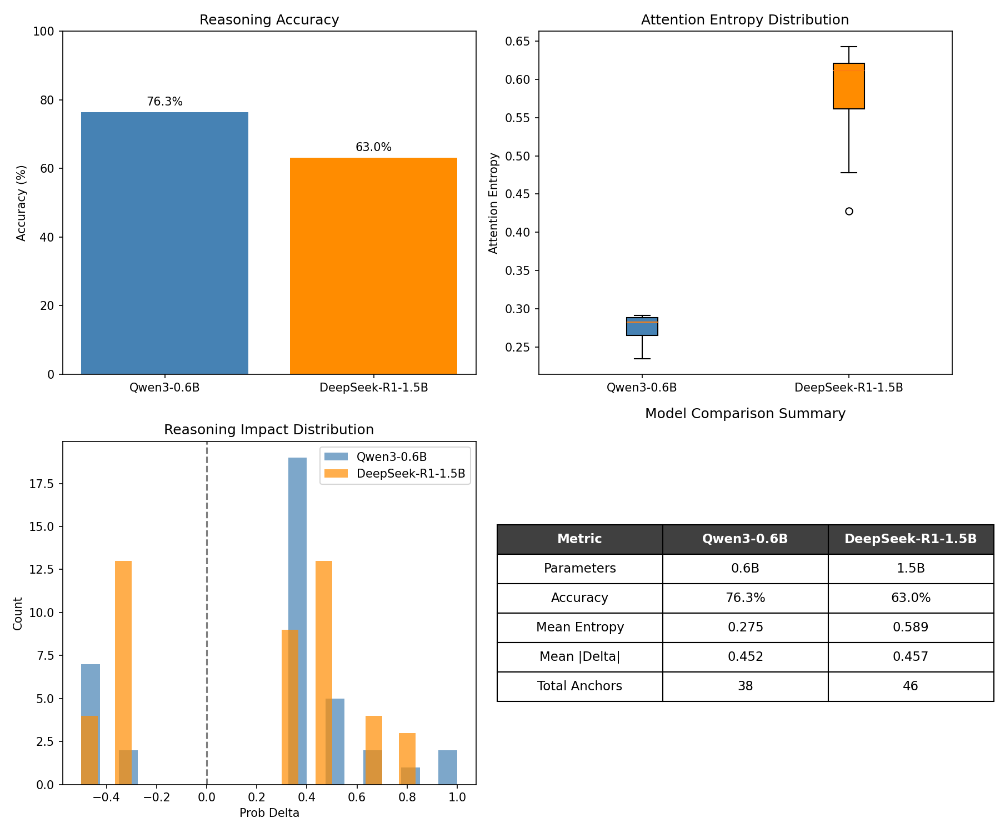
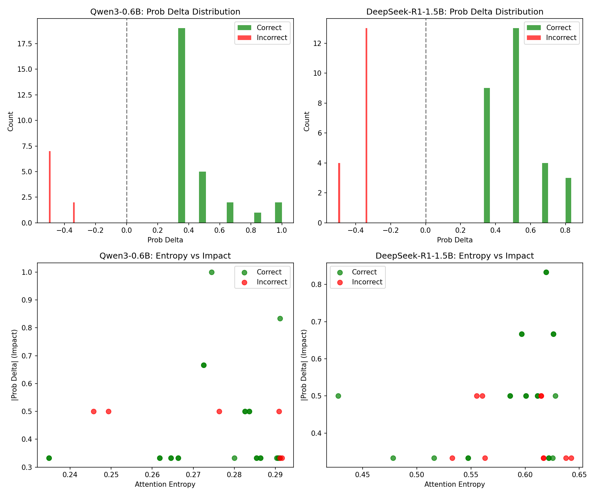
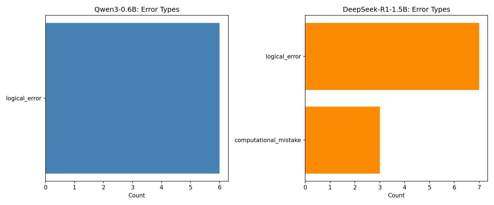

# Reasoning Circuits Across Model Families

Using [PTS (Pivotal Token Search)](https://github.com/codelion/pts) to study mechanistic interpretability of reasoning in LLMs.

## Research Question

**Do different LLM families implement arithmetic reasoning through distinct internal circuits, and can we identify structural fingerprints that predict reasoning reliability?**

## Key Findings

### 1. Lower Attention Entropy Correlates with Better Reasoning

| Model | Parameters | Accuracy | Mean Entropy |
|-------|------------|----------|--------------|
| Qwen3-0.6B | 0.6B | **76.3%** | **0.275** |
| DeepSeek-R1-1.5B | 1.5B | 63.0% | 0.589 |

The smaller Qwen model achieves **13% higher accuracy** with **2x more focused attention** (lower entropy). This suggests that focused attention patterns indicate more efficient reasoning circuits.



### 2. Attention Entropy Differs Significantly Across Models

Cross-model entropy comparison: **t=-27.5, p<0.0001**

Qwen3 shows a very tight entropy distribution (0.23-0.30), while DeepSeek has much wider spread (0.45-0.65). This indicates Qwen has learned more consistent attention patterns for mathematical reasoning.


### 3. Prob Delta Reveals Reasoning Quality

- **Positive prob_delta**: Thought anchor helps the model reach correct answer
- **Negative prob_delta**: Thought anchor hurts reasoning (indicates errors)

Incorrect reasoning steps consistently show negative prob_delta in both models, validating thought anchors as a reasoning quality signal.



### 4. Different Failure Modes

| Model | Error Types |
|-------|-------------|
| Qwen3-0.6B | Logical errors only |
| DeepSeek-R1-1.5B | Logical errors + Computational mistakes |

DeepSeek makes arithmetic calculation errors that Qwen avoids, despite being 2.5x larger.



## Methodology

This research uses **Thought Anchors** - sentences in a reasoning trace that significantly affect the model's probability of reaching the correct answer. Combined with attention pattern analysis inspired by the [CRV (Circuit-based Reasoning Verification)](https://arxiv.org/abs/2510.27484) approach.

### What PTS Provides

1. **Thought Anchor Detection**: Identifies pivotal reasoning steps via probability delta
2. **Attention Analysis**: Captures entropy and focus scores during reasoning
3. **Arithmetic Verification**: Ground-truth checking of computational steps
4. **Cross-Model Comparison**: Standardized metrics across different LLM families

## Reproducing the Results

### Prerequisites

```bash
# Clone PTS
git clone https://github.com/codelion/pts.git
cd pts

# Install dependencies
pip install -e .
pip install -r research/reasoning_circuits/requirements.txt
```

### Step 1: Generate Thought Anchors

```bash
# Qwen3-0.6B (takes several hours on MPS/CPU)
pts run \
  --model "Qwen/Qwen3-0.6B" \
  --dataset "openai/gsm8k" \
  --config "main" \
  --num-samples 3 \
  --max-examples 5 \
  --batch-size 1 \
  --generate-thought-anchors \
  --enable-verification \
  --output-path research/reasoning_circuits/data/qwen3_verified_anchors.jsonl

# DeepSeek-R1-1.5B
pts run \
  --model "deepseek-ai/DeepSeek-R1-Distill-Qwen-1.5B" \
  --dataset "openai/gsm8k" \
  --config "main" \
  --num-samples 3 \
  --max-examples 5 \
  --batch-size 1 \
  --generate-thought-anchors \
  --enable-verification \
  --output-path research/reasoning_circuits/data/deepseek_verified_anchors.jsonl
```

**Note**: For more robust results, increase `--max-examples` to 20-50 (requires more compute time).

### Step 2: Run Cross-Model Comparison

```bash
python research/reasoning_circuits/scripts/compare_models.py
```

This generates:
- `figures/entropy_comparison.png` - Entropy distributions by correctness
- `figures/error_types_comparison.png` - Error type breakdown
- `figures/verification_comparison.png` - Verification score distributions
- `figures/cross_model_summary.png` - Summary comparison

### Step 3: Run Deep Analysis

```bash
python research/reasoning_circuits/scripts/deep_analysis.py
```

This provides:
- Prob delta impact analysis
- Sentence pattern analysis (contrastive: correct vs incorrect)
- Entropy-impact correlations
- Per-query branch analysis
- Detailed failure mode breakdown

## Data Format

Each thought anchor in the JSONL files contains:

| Field | Description |
|-------|-------------|
| `model_id` | Model that generated this anchor |
| `query` | The math problem |
| `sentence` | The reasoning step (thought anchor) |
| `prob_delta` | Impact on answer probability (-1 to +1) |
| `is_positive` | Whether reasoning is correct |
| `attention_entropy` | Attention distribution spread (lower = focused) |
| `attention_focus_score` | Attention concentration (Gini coefficient) |
| `verification_score` | Correctness confidence (0-1) |
| `arithmetic_errors` | Detected computation errors |
| `failure_mode` | Type of error (logical_error, computational_mistake) |
| `full_reasoning_trace` | Complete model reasoning |

## Interpretation Guide

### Attention Entropy
- **Low entropy (< 0.3)**: Model focuses attention on specific tokens - indicates confident computation
- **High entropy (> 0.5)**: Attention spread across many tokens - may indicate uncertainty

### Prob Delta
- **Positive (+0.3 to +1.0)**: This sentence helps reach correct answer
- **Negative (-0.5 to -0.1)**: This sentence introduces errors
- **Near zero**: Sentence has little impact on reasoning

### Focus Score
- Based on Gini coefficient of attention weights
- Higher = more concentrated attention on key tokens

## Extending This Research

### Adding New Models

```bash
pts run \
  --model "YOUR_MODEL_NAME" \
  --dataset "openai/gsm8k" \
  --config "main" \
  --generate-thought-anchors \
  --enable-verification \
  --output-path research/reasoning_circuits/data/your_model_anchors.jsonl
```

### Custom Datasets

PTS supports any dataset with question/answer pairs:

```bash
pts run \
  --model "YOUR_MODEL" \
  --dataset "YOUR_DATASET" \
  --query-key "question" \
  --answer-key "answer" \
  --generate-thought-anchors \
  --enable-verification \
  --output-path your_output.jsonl
```

## References

- [Thought Branches: Interpreting LLM Reasoning Requires Resampling](https://arxiv.org/abs/2510.27484) - Inspiration for contrastive analysis and branch-based interpretation
- [GSM8K Dataset](https://huggingface.co/datasets/openai/gsm8k) - Grade school math benchmark

## Citation

If you use PTS for mechanistic interpretability research, please cite:

```bibtex
@software{pts2024,
  title = {PTS: Pivotal Token Search},
  author = {codelion},
  url = {https://github.com/codelion/pts},
  year = {2024}
}
```
