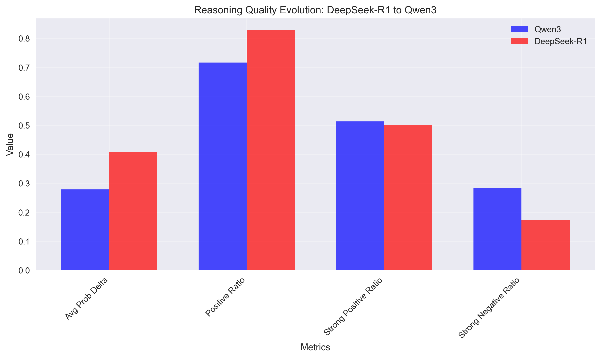
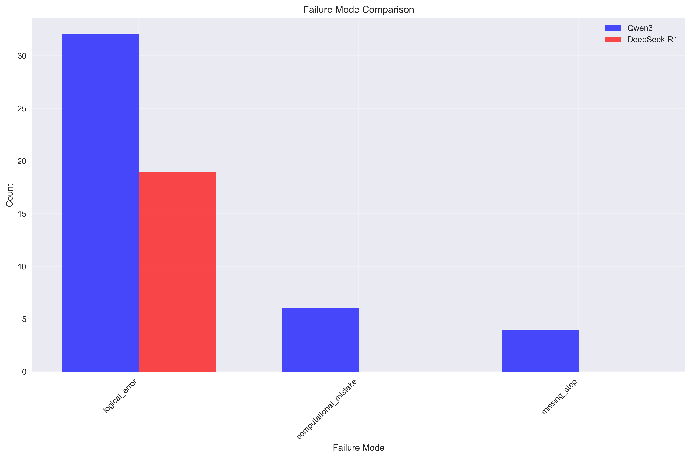
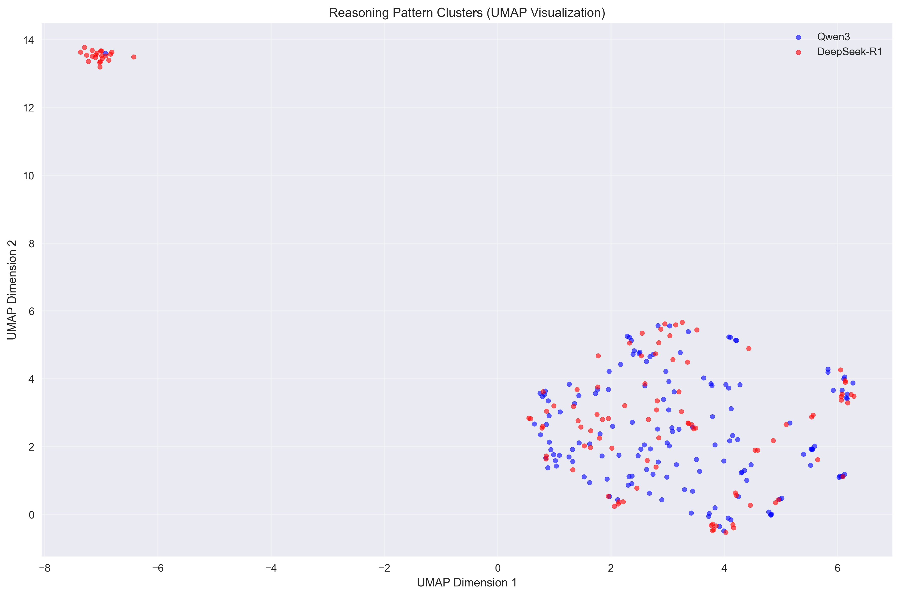

# Understanding Model Reasoning Through Thought Anchors: A Comparative Study of Qwen3 and DeepSeek-R1

*How do different language models think? A mechanistic interpretability study using thought anchors reveals surprising insights about reasoning evolution.*

## Introduction

Understanding how language models reason has become one of the most important challenges in AI safety and interpretability. While we can observe model outputs, the internal reasoning processes that lead to those outputs remain largely opaque. This study introduces a novel approach to peer inside the "black box" of model reasoning using **thought anchors** - critical sentences that significantly impact the probability of successful task completion.

Building on the original thought anchors concept introduced by [Bogdan et al. (2025)](https://arxiv.org/abs/2506.19143), we implemented this methodology using our [Pivotal Token Search (PTS) library](https://github.com/codelion/pts) to analyze two distinct language models: Qwen3-0.6B and DeepSeek-R1-Distill-Qwen-1.5B. Our findings reveal unexpected insights about how reasoning capabilities have evolved between these models.

## What Are Thought Anchors?

Thought anchors are sentences within a model's reasoning trace that have a significant causal impact on the success probability of completing a task. Unlike traditional interpretability methods that focus on individual tokens or attention patterns, thought anchors capture sentence-level reasoning steps that matter most for task completion.

The methodology, as introduced by Bogdan et al. (2025), works by:
1. **Generating reasoning traces** using chain-of-thought prompting with `<think>` tags
2. **Identifying critical sentences** using counterfactual analysis
3. **Measuring impact** by comparing success probabilities with and without each sentence
4. **Analyzing failure modes** to understand common reasoning pitfalls

Our PTS implementation extends this approach by:
- Collecting comprehensive metadata about each thought anchor
- Generating 384-dimensional semantic embeddings for clustering analysis
- Tracking causal dependencies between reasoning steps
- Categorizing failure modes for systematic analysis

## Dataset Overview

### Thought Anchor Generation Process

To ensure fair comparison between models, we used identical experimental conditions for both Qwen3 and DeepSeek-R1:

**Data Source**: Both models were evaluated on the same subset of the [GSM8K dataset](https://huggingface.co/datasets/gsm8k) - a standard benchmark for mathematical reasoning containing grade school math word problems.

**Generation Settings**: Using our PTS library, we generated thought anchors with consistent parameters:
- Same temperature and sampling settings
- Identical prompt templates with `<think>` tags for chain-of-thought reasoning
- Same oracle evaluation criteria for determining task success
- Consistent counterfactual analysis methodology

**Resulting Datasets**:
- **Qwen3-0.6B**: 148 thought anchors from 56 mathematical reasoning queries
- **DeepSeek-R1-Distill-Qwen-1.5B**: 110 thought anchors from 32 mathematical reasoning queries

The difference in dataset sizes reflects the models' different reasoning patterns - Qwen3 generated more diverse reasoning traces per query, while DeepSeek-R1 produced more focused, concise reasoning steps.

Both datasets are available on HuggingFace:
- [codelion/Qwen3-0.6B-pts-thought-anchors](https://huggingface.co/datasets/codelion/Qwen3-0.6B-pts-thought-anchors)
- [codelion/DeepSeek-R1-Distill-Qwen-1.5B-pts-thought-anchors](https://huggingface.co/datasets/codelion/DeepSeek-R1-Distill-Qwen-1.5B-pts-thought-anchors)

## Key Findings: Different Reasoning Architectures Revealed

Our analysis uncovered fundamental differences in how these models approach reasoning, revealing distinct cognitive architectures that challenge simple notions of "better" vs "worse" reasoning.

### Finding 1: Concentrated vs Distributed Reasoning Strategies

The models exhibit fundamentally different reasoning impact patterns:
- **DeepSeek-R1**: 0.408 average prob_delta (concentrated reasoning)
- **Qwen3**: 0.278 average prob_delta (distributed reasoning)

**Important Context**: DeepSeek-R1 is a larger model (1.5B parameters) compared to Qwen3 (0.6B parameters), and appears optimized for reasoning tasks through distillation from larger reasoning-focused models.

**What This Reveals**: Rather than indicating superiority, these different prob_delta values suggest distinct reasoning architectures:
- **DeepSeek-R1**: Fewer, high-impact reasoning steps - concentrated cognitive effort
- **Qwen3**: More distributed reasoning with impact spread across multiple steps


### Finding 2: Risk-Reward Profiles in Reasoning

The models show distinct risk-reward profiles that reflect their architectural differences:

**DeepSeek-R1: High-Confidence, Consistent Approach**
- Higher positive ratio (82.7% vs 71.6%)
- Tighter distribution around positive values
- More predictable reasoning patterns
- Risk-adjusted quality score: 0.845
- **Strategy**: Fewer, more reliable reasoning steps

**Qwen3: Exploratory, High-Variance Approach**
- Wider distribution of impacts
- More extreme positive and negative values
- Higher variance in reasoning quality
- Risk-adjusted quality score: 0.466
- **Strategy**: More experimental reasoning with higher potential upside and downside



### Finding 3: Reasoning Complexity vs Reliability Trade-offs

The models exhibit different trade-offs between reasoning complexity and reliability:

**Qwen3 - Complex, Multi-Modal Failures (3 types)**:
- Logical errors: 32 instances
- Computational mistakes: 6 instances  
- Missing steps: 4 instances
- **Interpretation**: Attempts more complex reasoning chains with diverse failure points

**DeepSeek-R1 - Focused, Consistent Failures (1 type)**:
- Logical errors: 19 instances
- **Interpretation**: Maintains simpler, more focused reasoning with concentrated failure modes



**Key Insight**: This reveals a fundamental trade-off in reasoning system design:
- **Qwen3**: Higher complexity → more diverse capabilities but more failure modes
- **DeepSeek-R1**: Lower complexity → more reliable but potentially less versatile reasoning

## Mechanistic Interpretability Insights

### Cognitive Architecture Differences

Our analysis reveals fundamental differences in how these models approach reasoning:

**1. Reasoning Granularity and Processing Style**
- **Qwen3**: Longer average sentences (58.0 characters) → processes information in larger, more integrated chunks
- **DeepSeek-R1**: Shorter average sentences (47.7 characters) → uses more atomic, step-by-step reasoning

**2. Optimization Objectives**
- **DeepSeek-R1**: Optimized for reasoning reliability and consistency (distilled from reasoning-focused models)
- **Qwen3**: Optimized for broader capabilities with reasoning as one component

**3. Architectural Trade-offs**
- **DeepSeek-R1**: Sacrifices exploration for reliability
- **Qwen3**: Sacrifices consistency for reasoning diversity

**4. Reasoning Personalities**
The embedding analysis reveals distinct clustering patterns, suggesting the models have developed different "reasoning personalities":



### Implications for AI Safety and System Design

These findings reveal important considerations for AI safety and system design:

**Reliability vs Innovation Trade-off**:
- **DeepSeek-R1 approach**: Prioritizes predictable, consistent reasoning - ideal for safety-critical applications
- **Qwen3 approach**: Enables experimental reasoning with higher variance - valuable for research and creative tasks

**Different Safety Profiles**:
- **DeepSeek-R1**: Lower risk of unexpected failures, but potential blind spots due to focused failure modes
- **Qwen3**: Higher variance introduces uncertainty, but diverse failure modes provide better coverage of potential issues

**System Design Implications**:
- Choose reasoning architecture based on application requirements
- Consider hybrid approaches that combine both strategies
- Develop monitoring systems adapted to each reasoning style

## Case Studies: Reasoning in Action

### Most Impactful Positive Examples

**Qwen3 (prob_delta = 1.000)**:
- Query: "Mark has a garden with flowers. He planted plants of three different colors..."
- Critical sentence: "First, we need to figure out the number of flowers in each color..."
- Impact: This systematic approach immediately clarifies the problem structure

**DeepSeek-R1 (prob_delta = 1.000)**:
- Query: "Ken created a care package to send to his brother..."
- Critical sentence: "Next, he adds **2 pounds** of jelly beans..."
- Impact: Precise quantification with emphasis drives success

### Most Impactful Negative Examples

**Qwen3 (prob_delta = -1.000)**:
- Query: "Mrs. Snyder used to spend 40% of her monthly income on rent..."
- Critical sentence: "4x = 0..."
- Failure mode: missing_step
- Impact: Incomplete equation setup derails the entire solution

**DeepSeek-R1 (prob_delta = -1.000)**:
- Query: "Leo's assignment was divided into three parts..."
- Critical sentence: "Adding 25 and 50 gives 75..."
- Failure mode: logical_error
- Impact: Incorrect arithmetic leads to wrong conclusion

## Practical Recommendations

### For AI Practitioners

**Choose DeepSeek-R1 for**:
- Production systems requiring consistent performance
- Safety-critical applications
- Tasks where reliability > creativity

**Choose Qwen3 for**:
- Research and exploration tasks
- Creative problem-solving scenarios
- Applications where breakthrough insights are valued

### For Researchers

**Study DeepSeek-R1's mechanisms**:
- Investigate what drives its consistency
- Understand its risk-averse reasoning patterns
- Explore applications in safe AI systems

**Investigate Qwen3's experimental nature**:
- Analyze its diverse failure modes
- Study its high-variance reasoning patterns
- Develop better failure detection systems

### For Future Model Development

**Design Considerations**:
- Balance consistency vs. exploration in reasoning
- Implement failure mode detection for diverse error types
- Consider reasoning granularity in architecture design
- Develop hybrid approaches combining both strengths

## Methodology and Reproducibility

### Thought Anchor Generation

All thought anchors were generated using identical procedures to ensure fair comparison:

**Step 1: Data Preparation**
- Both models evaluated on the same GSM8K problems
- Consistent prompt formatting with `<think>` tags for reasoning
- Same mathematical oracle for success evaluation

**Step 2: Thought Anchor Extraction**
```python
# Generate thought anchors for Qwen3
pts run --model="Qwen/Qwen3-0.6B" --dataset="gsm8k" --output-path="qwen3_thought_anchors.jsonl" --generate-thought-anchors

# Generate thought anchors for DeepSeek-R1
pts run --model="deepseek-ai/DeepSeek-R1-Distill-Qwen-1.5B" --dataset="gsm8k" --output-path="deepseek_thought_anchors.jsonl" --generate-thought-anchors

# Export to HuggingFace
pts export --input-path="qwen3_thought_anchors.jsonl" --format="thought_anchors" --output-path="qwen3_export.jsonl"
pts export --input-path="deepseek_thought_anchors.jsonl" --format="thought_anchors" --output-path="deepseek_export.jsonl"
```

**Step 3: Comparative Analysis**
All analysis is fully reproducible using our open-source tools:

1. **Data Collection**: Generated using [PTS library](https://github.com/codelion/pts) on GSM8K
2. **Analysis Pipeline**: Available in the analysis repository
3. **Visualizations**: Created using matplotlib, seaborn, and plotly
4. **Statistical Analysis**: Standard scipy and numpy methods

The identical generation process ensures that observed differences reflect genuine model characteristics rather than experimental artifacts.

## Limitations and Future Work

### Current Limitations

1. **Dataset Size**: Limited to 148 and 110 thought anchors respectively
2. **Domain Specificity**: Focused on mathematical reasoning tasks
3. **Model Size**: Analysis limited to smaller models (0.6B and 1.5B parameters)
4. **Temporal Snapshot**: Single-point analysis without longitudinal tracking

### Future Directions

1. **Scale Analysis**: Extend to larger models (7B, 13B, 70B parameters)
2. **Multi-Domain**: Analyze reasoning across different task types
3. **Temporal Evolution**: Track reasoning changes across model training
4. **Intervention Studies**: Test causal relationships experimentally
5. **Hybrid Architectures**: Develop models combining both reasoning approaches

## Conclusion

This study demonstrates the power of thought anchors as a mechanistic interpretability tool for understanding model reasoning. Our key findings reveal fundamental insights about reasoning architecture diversity in language models:

1. **Different architectures, not better/worse**: Models optimize for different reasoning objectives (consistency vs. exploration)
2. **Concentrated vs. distributed reasoning**: DeepSeek-R1 uses fewer, high-impact steps while Qwen3 distributes reasoning across multiple steps
3. **Complexity-reliability trade-offs**: More complex reasoning leads to diverse capabilities but also diverse failure modes
4. **Context-dependent superiority**: Neither approach is universally superior - performance depends on application requirements

These insights have profound implications for AI safety, model selection, and future development. Rather than seeking a single "best" reasoning approach, we should:
- **Understand trade-offs**: Recognize that different reasoning architectures serve different purposes
- **Match models to tasks**: Choose reasoning styles based on application requirements
- **Design hybrid systems**: Combine concentrated and distributed reasoning approaches
- **Develop adaptive monitoring**: Create safety systems tailored to each reasoning style

The thought anchors methodology, implemented through our PTS library, provides a scalable approach to understanding model reasoning that can be applied across different architectures, scales, and domains. We encourage the community to build upon this work to develop better interpretability tools and more effective AI systems.

## Acknowledgments

This work builds on the original thought anchors concept introduced by Bogdan et al. (2025) and extends it through the Pivotal Token Search methodology. We thank the broader AI safety and interpretability communities for their foundational work in this area.

## References

- Bogdan, P. C., Macar, U., Nanda, N., & Conmy, A. (2025). Thought Anchors: Which LLM Reasoning Steps Matter? *arXiv preprint arXiv:2506.19143*. Retrieved from https://arxiv.org/abs/2506.19143

## Resources

- **PTS Library**: [https://github.com/codelion/pts](https://github.com/codelion/pts)
- **Qwen3 Dataset**: [codelion/Qwen3-0.6B-pts-thought-anchors](https://huggingface.co/datasets/codelion/Qwen3-0.6B-pts-thought-anchors)
- **DeepSeek Dataset**: [codelion/DeepSeek-R1-Distill-Qwen-1.5B-pts-thought-anchors](https://huggingface.co/datasets/codelion/DeepSeek-R1-Distill-Qwen-1.5B-pts-thought-anchors)
- **Analysis Code**: [https://github.com/codelion/pts/tree/main/thought_anchors_analysis](https://github.com/codelion/pts/tree/main/thought_anchors_analysis)

---

*This research was conducted using the Pivotal Token Search (PTS) library for mechanistic interpretability analysis. All datasets and analysis code are available for reproducibility.*
